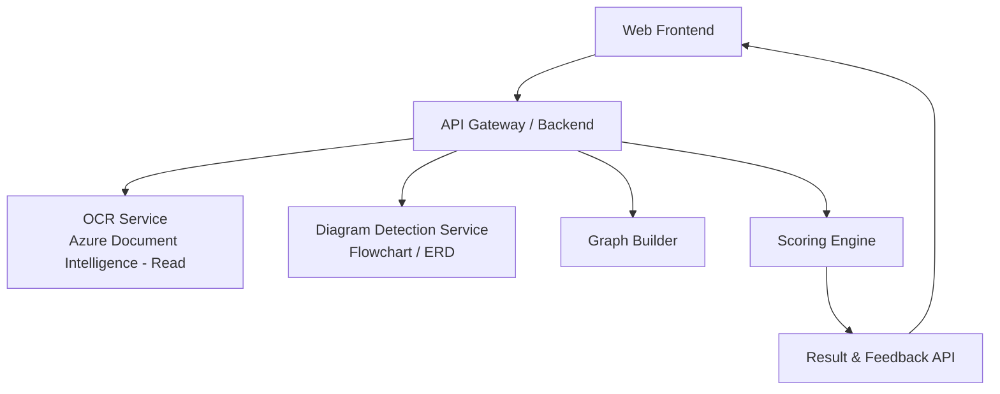
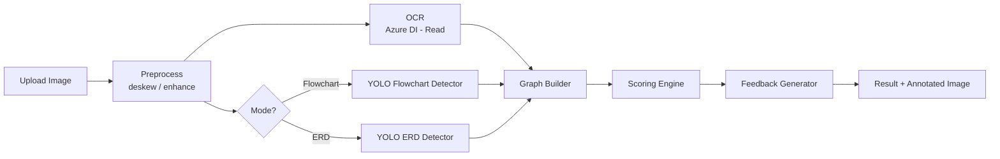
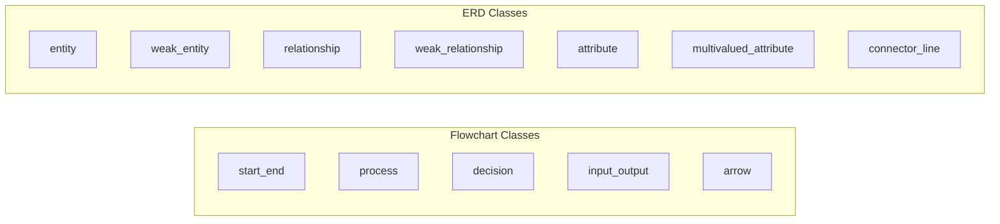

# AI Diagram Grader (Flowchart + ERD)

เว็บแอปสำหรับ **อาจารย์** ใช้ตรวจข้อสอบอัตโนมัติจาก **รูปถ่ายลายมือนักศึกษา** สำหรับรายวิชาที่ใช้ **Flowchart** และ **ER Diagram (ERD)** โดยรวม Computer Vision (**YOLO**) เข้ากับ OCR (**Azure Document Intelligence – Read**) เพื่ออ่านข้อความและวิเคราะห์โครงสร้างไดอะแกรม แล้วให้คะแนน + ฟีดแบ็กเชิงโครงสร้าง

> **สถานะปัจจุบัน (Work in Progress):** กำลังพัฒนาเป็นส่วน ๆ — ยังไม่ได้เชื่อม OCR (Azure DI) และ YOLO เข้ากับ pipeline หลัก เวอร์ชันที่รันได้ตอนนี้เป็น MVP ที่ใช้ Tesseract + OpenCV heuristic

---

## 1) วัตถุประสงค์ระบบ (Project Objective)

ระบบนี้คือ **เว็บแอปสำหรับอาจารย์ใช้ตรวจข้อสอบอัตโนมัติจากรูปถ่ายลายมือนักศึกษา** สำหรับรายวิชาที่ใช้ Flowchart และ ER Diagram (ERD)

**ผู้ใช้งาน (User Role)**
- **อาจารย์ / TA** เท่านั้น เป็นผู้อัปโหลดรูปถ่ายข้อสอบของนักศึกษา (นักศึกษาไม่ได้ล็อกอินเข้าระบบเอง)

**ความสามารถหลัก**
- อาจารย์สร้างข้อสอบ + อัปโหลด **เฉลย (Answer Key)**
- อาจารย์อัปโหลด **รูปถ่ายข้อสอบนักศึกษา** (ทีละรูป หรือ batch)
- เลือกโหมดการตรวจ: **Flowchart** หรือ **ER Diagram**
- ระบบอ่านลายมือ (OCR) + วิเคราะห์โครงสร้างไดอะแกรม
- ให้คะแนนอัตโนมัติ พร้อม **Feedback เชิงโครงสร้าง** + Export CSV/XLSX
- อาจารย์สามารถปรับคะแนน (manual override) ได้

---

## 1.1) สถานะการพัฒนา (Roadmap)

| สถานะ | โมดูล | หมายเหตุ |
|---|---|---|
| ✅ Done | Web frontend (upload, mode selector) | ใช้งานได้ |
| ✅ Done | Backend API + DB (`data/app.db`) | Flask + SQLite |
| ✅ Done | OCR (MVP) | ใช้ Tesseract / OCR.space |
| ✅ Done | Diagram detection (MVP) | OpenCV heuristic |
| ✅ Done | Scoring + Export CSV/XLSX | ใช้งานได้ |
| 🚧 WIP | OCR → **Azure Document Intelligence – Read** | กำลังเชื่อม |
| 🚧 WIP | Detection → **YOLO (custom-trained)** | กำลังเทรน/เชื่อม |
| ⏳ Planned | Graph Builder (head–tail arrow linking) | รอ YOLO พร้อม |
| ⏳ Planned | Arrow R-CNN / DrawnNet (fallback) | ถ้า YOLO ไม่พอ |

---

## 2) ภาพรวมสถาปัตยกรรม (High-Level Architecture)



### Pipeline การประมวลผล (End-to-End)



---

## 3) การแบ่ง Modules (Module Breakdown)

### 3.1 Frontend (Web UI)
**หน้าที่**
- อาจารย์อัปโหลดรูปสอบของนักศึกษา (jpg / png / pdf)
- เลือกโหมด: Flowchart / ERD
- แสดงผลคะแนน + Feedback + ปรับคะแนน manual ได้

**ฟังก์ชันหลัก**
- Login (admin / teacher / ta)
- Image Upload (single / batch)
- Mode Selector
- Result Viewer (score + annotated image)

### 3.2 Backend API (Core System)
ควบคุม workflow ทั้งหมดและเป็นตัวกลางเรียก service ต่าง ๆ

**Module: Upload & Preprocess**
- ตรวจชนิดไฟล์
- Resize / deskew / enhance contrast (optional)

### 3.3 OCR Module (Text Recognition)
- **Technology:** Azure AI Document Intelligence – Read
- **Input:** รูปข้อสอบ
- **Output:** ข้อความ (text) + ตำแหน่ง (bounding box / line)
- **Responsibility:** อ่านลายมือในกล่อง Flowchart หรือ Entity/Attribute → ส่งผลให้ Graph Builder

### 3.4 Diagram Detection Module (Computer Vision)

#### 3.4.1 Flowchart Detector
- **Model:** YOLO (custom-trained) อิงคลาสจาก Flowchart 3B / Flowchart dataset (มีลูกศร 4 ทิศ + shape หลัก)
- **Detect Classes:** `start_end`, `process`, `decision`, `input_output`, `arrow`
- **Output:** Bounding boxes + class + confidence

#### 3.4.2 ER Diagram Detector
- **Model:** YOLO (custom-trained)
- **Detect Classes:** `entity`, `weak_entity`, `relationship`, `weak_relationship`, `attribute`, `multivalued_attribute`, `connector_line`



### 3.5 Graph Builder Module (หัวใจของระบบ)
แปลงผล OCR + Detection → โครงสร้างกราฟ (Diagram Structure)

**หน้าที่**
- สร้าง Node จากกล่อง/สัญลักษณ์
- เชื่อม Edge จากลูกศร/เส้น (head–tail)
- ผูก Text (OCR) เข้ากับ Node ที่ครอบตำแหน่งของข้อความ

**Rules (ตัวอย่าง)**
- Flowchart: arrow ต้องมีต้นทางและปลายทาง
- ERD: attribute ต้องเชื่อมกับ entity / relationship เท่านั้น

> หากเชื่อมลูกศรไม่แม่น → ขยับไปใช้ **Arrow R-CNN** (ออกแบบเพื่อ structure โดยตรง) หรือแนว **Arrow-Guided VLM** ที่เน้น encoding ทิศลูกศร

### 3.6 Scoring Engine
ให้คะแนนโดยเทียบกับ **Answer Key Structure**

**วิธีคิดคะแนน (Configurable)**

| เกณฑ์ | น้ำหนัก |
|---|---|
| Structure correctness (เชื่อมถูก) | 50% |
| Node correctness (ชนิดกล่อง) | 30% |
| Text correctness (ชื่อ/คำ) | 20% |

### 3.7 Feedback Generator
- Highlight จุดผิด (ลูกศรผิดทิศ / ขาดกล่อง)
- Comment เป็นข้อความ

---

## 4) เทคโนโลยีและเหตุผล

### 4.1 OCR — ทำไมเลือก Azure Document Intelligence – Read
- เหมาะกับ **เอกสาร / รูปถ่ายกระดาษ** รองรับทั้ง **ข้อความพิมพ์ + ลายมือ** พร้อมตำแหน่งคำ/บรรทัด
- ผลลัพธ์มีโครงสร้าง (bounding box) เอาไปประกอบกับโมเดลอ่านไดอะแกรมต่อได้ดี

**Free tier (F0)**
- ฟรี 0–500 pages/เดือน
- PDF/TIFF บน Free tier ประมวลผล **เฉพาะ 2 หน้าแรก**

**S0 (Pay-as-you-go)**
- 0–1M pages: **$1.50 / 1,000 pages**
- 1M+ pages: **$0.60 / 1,000 pages**

> สำหรับงานจริงที่มีหลายหน้า ควรใช้ S0 เพื่อไม่ติดเพดาน Free tier

### 4.2 ตัวเลือก OCR อื่น ๆ ที่พิจารณา

| ตัวเลือก | ข้อดี | ข้อเสีย |
|---|---|---|
| Tesseract / Tesseract.js | ฟรี (Apache 2.0) | ลายมือจากรูปถ่ายแม่นยำต่ำ |
| Azure Document Intelligence – Read | แม่นยำสูง รองรับลายมือ + ตำแหน่ง | มีค่าใช้จ่ายเมื่อเกิน Free tier |
| Azure AI Vision – Read/OCR | เหมาะภาพเดี่ยว / UX เร็ว | คิดเป็น transactions ($1.50/1k) |
| Power Platform (AI Builder OCR) | ผูกกับ Power Platform | ~3 credits / image (~$0.0015) |

### 4.3 ML / Computer Vision — ทำไม YOLO + ทำไมไม่พอ
- **YOLO** ดีมากสำหรับ **ตรวจจับสัญลักษณ์** (boxes, decision, arrow ฯลฯ) ทั้ง Flowchart / ERD
- แต่ YOLO อย่างเดียว **ไม่เข้าใจโครงสร้างการเชื่อม (graph structure)** ซึ่งจำเป็นต่อการตรวจข้อสอบ
- ทางเลือกเสริมเมื่อความแม่นยำการเชื่อมไม่พอ:
  - **Arrow R-CNN** — ตรวจจับ arrow head/tail keypoints เพื่อ reconstruct ไดอะแกรม
  - **DrawnNet** — keypoint-based เข้าใจทิศลูกศร
  - **Arrow-Guided VLM** — LLM เข้าใจ flow โดย encoding ทิศลูกศร

### 4.4 ทำไมต้องแยกโหมด Flowchart / ERD
สัญลักษณ์ + กติกาการเชื่อม **คนละแบบ**:
- **Flowchart:** start/end, process, decision, I/O + ลูกศรเป็น *ทิศทางการไหล*
- **ERD:** entity, relationship, attribute, weak/multivalued + เส้นเชื่อมเป็น *ความสัมพันธ์ข้อมูล*

---

## 5) Features
- Login with roles (admin / teacher / ta) — **อาจารย์เป็นผู้ใช้หลัก**
- Create exam
- Upload answer key (image or PDF first page)
- Configure rubric weights
- **Batch upload student submissions (อาจารย์อัปโหลดงานนักศึกษา)**
- Auto analyze and score (OCR + ML)
- Detailed feedback + OCR text
- Manual score override with audit log
- Export results to CSV / XLSX

## 6) Default Accounts
- `admin / admin123`
- `teacher / teacher123`
- `ta / ta123`

## 7) Quick Start
1. Install dependencies:
   ```bash
   pip install -r requirements.txt
   ```
2. Run app:
   ```bash
   python app.py
   ```
3. Open: http://127.0.0.1:5000

### Easy Run/Stop Commands (Windows)
```powershell
.\run_web.ps1
.\stop_web.ps1
```
หรือดับเบิลคลิก `run_web.cmd` / `stop_web.cmd`

## 8) Configuration

### OCR Provider Modes
- Default: `local` (Tesseract ในเครื่อง)
- Web API mode: `ocrspace`
- Production: `azure_di` (Azure Document Intelligence – Read)

```powershell
$env:OCR_PROVIDER = "azure_di"
$env:AZURE_DI_ENDPOINT = "https://<your-resource>.cognitiveservices.azure.com/"
$env:AZURE_DI_KEY = "<your_key>"
python app.py
```

ถ้าใช้ `ocrspace`:
```powershell
$env:OCR_PROVIDER = "ocrspace"
$env:OCRSPACE_API_KEY = "your_api_key"
python app.py
```

ถ้าใช้ Tesseract และไม่อยู่ใน PATH:
```powershell
$env:TESSERACT_CMD = "C:\Program Files\Tesseract-OCR\tesseract.exe"
python app.py
```

## 9) Paths
- Database: `data/app.db`
- Uploads: `uploads/`
- Exports: `data/exports/`

---

## 10) สรุปสั้น (TL;DR)
- **OCR:** Azure Document Intelligence – Read (Free 500 pages/mo, S0 $1.50 / 1k pages)
- **Detector:** YOLO (custom-trained per mode) — Flowchart 3B / ERD classes
- **Structure:** Graph Builder + (ทางเลือก Arrow R-CNN / DrawnNet) สำหรับเชื่อม head–tail
- **Scoring:** Structure 50% / Node 30% / Text 20%
- **Modes:** Flowchart และ ERD แยก detector + rules แต่ใช้ OCR / pipeline กลางร่วมกัน
